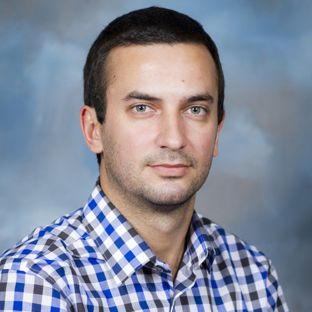
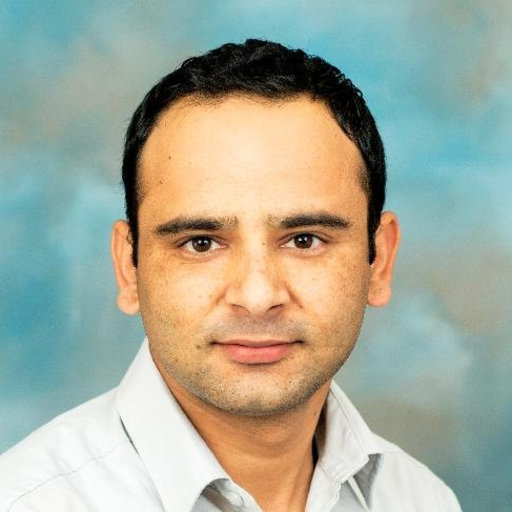
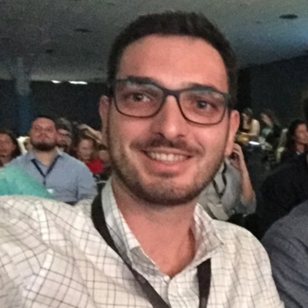

## Current Members

[Esteban Rios](https://foragebreeding.github.io/)             |  Yolanda Lopez
:--------------:|:------------:
  |  
Assistant Professor, PI | Biological Scientist

Dev Paudel  | [Cleber de Souza](https://www.researchgate.net/profile/Cleber_Henrique_De_Souza)
:------------:|:------------:
 | 
Postdoctoral Associate | Postdoctoral Associate

Janam Acharya  | Anju Biswas
:------------:|:------------:
 | 
MS Student | PhD Student

Augusto Mendoza  | Adina Grossman
:------------:|:------------:
 | 
MS Student | MS Student

## Lab Alumni

[Beatriz Gouveria](https://www.researchgate.net/profile/Beatriz_Gouveia3): Visiting Student 2019 (PhD Student, Universidade Federal de Lavras (UFLA), Lavras, Brazil)

## Current collaborators

**Crop modeling of alfalfa**

* [Ken Bootee](http://ufrfprofessors.feed.research.ufl.edu/ufrf_professors/boote-kenneth-j/)

[Esteban Rios](https://foragebreeding.github.io/)             |  Yolanda Lopez
:--------------:|:------------:
  |  
Assistant Professor, PI | Biological Scientist

 <b>Esteban Rios</b>, Assistant Professor
